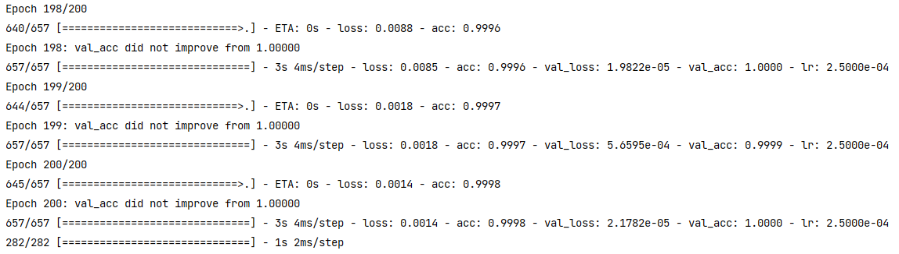

# AI 수어 실시간 번역 모델
This is a sample program that recognizes hand signs (Python version).
<br><br>

## Requirements
* mediapipe 0.8.1
* OpenCV 4.1.0 or Later
* Tensorflow 2.4.0 or Later (Only when creating a LSTM model)
* Keras 2.4.0 or Later (Only if you want to display the confusion matrix) 
* matplotlib 3.3.2 or Later (Only if you want to display the confusion matrix)

## Demo
Here's how to run the demo using your webcam.
```bash
python test.py
```

The following options can be specified when running the demo.
* --device<br>Specifying the camera device number (Default：0)
* --width<br>Width at the time of camera capture (Default：640)
* --height<br>Height at the time of camera capture (Default：480)
* --min_detection_confidence<br>
Detection confidence threshold (Default：0.7)
* --min_tracking_confidence<br>
Tracking confidence threshold (Default：0.7)

## Directory
<pre>
│  create_dataset.py
│  README.md
│  test.py
│  train.py
│
├─.idea
│  │  .gitignore
│  │  Hand_Sign.iml
│  │  misc.xml
│  │  modules.xml
│  │  vcs.xml
│  │  workspace.xml
│  │
│  └─inspectionProfiles
│          profiles_settings.xml
│          Project_Default.xml
│
├─dataset
│      raw_dot.npy
│      raw_감사합니다.npy
│      raw_발표.npy
│      raw_삭제.npy
│      raw_수어.npy
│      raw_시작.npy
│      raw_안녕하세요.npy
│      raw_입니다.npy
│      raw_팀.npy
│      raw_하겠습니다.npy
│      seq_dot.npy
│      seq_감사합니다.npy
│      seq_발표.npy
│      seq_삭제.npy
│      seq_수어.npy
│      seq_시작.npy
│      seq_안녕하세요.npy
│      seq_입니다.npy
│      seq_팀.npy
│      seq_하겠습니다.npy
│
├─fonts
│      SCDream6.otf
│
├─img
│      Create_Dataset.gif
│      epoch.png
│      Figure.png
│      hand_landmarks.png
│      Hand_Sign.gif
│      Layer.png
│      model.png
│      seq_data.png
│      shape.png
│      split_data.png
│
└─models
        model.h5

</pre>
### create_dataset.py
This is a vector coordinate data collection script for model training.

### train.py
This is a model training script for sign language recognition.

### test.py
This is a model test script for hand sign language recognition.

## Sign language recognition training
* Wait 80 seconds or press "q" to enter the mode to save the key point.（displayed as "Waiting for collecting {action} action...")）<br>
<br><br>
### 1. Sequence data structure
* MediaPipe Hands<br>
<br><br>
* Store 21 joint vector coordinates ([20,3]) and 15 angles ([15,]) in 10 sequences -> (3363,10,99)<br>
<br><br>
### 2. Model training
* Split Train/Test<br>
<br><br>
```bash
print(x_train.shape, y_train.shape)
print(x_val.shape, y_val.shape)
```
<br><br>
* Model<br>
<br><br>
* Epoch<br>
<br><br>
* Figure<br>


### Model structure
The model using "LSTM" is as follows.<br>
<br>

## Reference
* [MediaPipe](https://mediapipe.dev/)

## Contributors
hya0906(https://github.com/hya0906)
 
## License 
Hand-Sign is under [MIT license](LICENSE).
